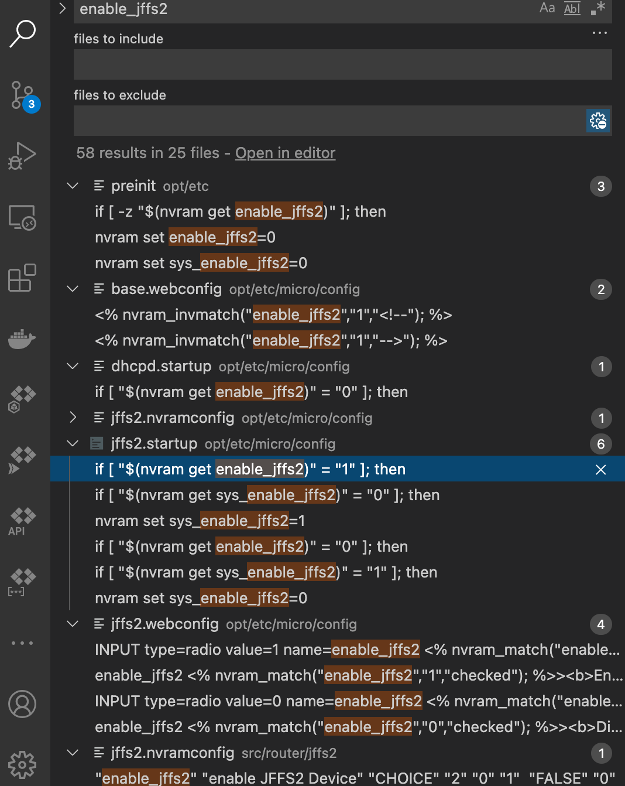

# Archer c8

The unsupported v4 has 128 MiB flash but otherwise appears to have the same specifications.


ssh -oKexAlgorithms=+diffie-hellman-group14-sha1 admin@192.168.0.1


binwalk -W -I foo1.bin foo2.bin (bin diff, shows diff only)


```ask

admin@Akronite:/tmp$ cat /proc/cpu
cat: read error: Is a directory
admin@Akronite:/tmp$ cat /proc/cpu
cpu/     cpuinfo
admin@Akronite:/tmp$ cat /proc/cpuinfo
Processor	: ARMv7 Processor rev 0 (v7l)
processor	: 0
BogoMIPS	: 1599.07

processor	: 1
BogoMIPS	: 1595.80

Features	: swp half thumb fastmult edsp 
CPU implementer	: 0x41
CPU architecture: 7
CPU variant	: 0x3
CPU part	: 0xc09
CPU revision	: 0

Hardware	: Northstar Prototype
Revision	: 0000
Serial		: 0000000000000000


partition 01: name = factory-boot    , base = 0x00000000, size = 0x00040000 Bytes, usedFlag = 1M
partition 02: name = fs-uboot        , base = 0x00040000, size = 0x00040000 Bytes, usedFlag = 1M
partition 03: name = os-image        , base = 0x00080000, size = 0x00200000 Bytes, usedFlag = 1M
partition 04: name = file-system     , base = 0x00280000, size = 0x00c80000 Bytes, usedFlag = 1M
partition 05: name = default-mac     , base = 0x00f00000, size = 0x00000200 Bytes, usedFlag = 1M
partition 06: name = pin             , base = 0x00f00200, size = 0x00000100 Bytes, usedFlag = 1M
partition 07: name = device-id       , base = 0x00f00300, size = 0x00000100 Bytes, usedFlag = 1M
partition 08: name = product-info    , base = 0x00f10000, size = 0x00006000 Bytes, usedFlag = 1M
partition 09: name = soft-version    , base = 0x00f16000, size = 0x00001000 Bytes, usedFlag = 1M
partition 10: name = extra-para      , base = 0x00f17000, size = 0x00001000 Bytes, usedFlag = 1M
partition 11: name = support-list    , base = 0x00f18000, size = 0x00008000 Bytes, usedFlag = 1M
partition 12: name = profile         , base = 0x00f20000, size = 0x00003000 Bytes, usedFlag = 1M
partition 13: name = default-config  , base = 0x00f23000, size = 0x0000d000 Bytes, usedFlag = 1M
partition 14: name = user-config     , base = 0x00f30000, size = 0x00040000 Bytes, usedFlag = 1M
partition 15: name = qos-db          , base = 0x00f70000, size = 0x00040000 Bytes, usedFlag = 1M
partition 16: name = partition-table , base = 0x00fb0000, size = 0x00010000 Bytes, usedFlag = 1M
partition 17: name = log             , base = 0x00fc0000, size = 0x00020000 Bytes, usedFlag = 1M
partition 18: name = radio_bk        , base = 0x00fe0000, size = 0x00010000 Bytes, usedFlag = 1M
partition 19: name = radio           , base = 0x00ff0000, size = 0x00010000 Bytes, usedFlag = 1M
partition 20: name =                 , base = 0x00000000, size = 0x00000000 Bytes, usedFlag = 0M

admin@Akronite:/$ cat /proc/mtd
dev:    size   erasesize  name
mtd0: 00080000 00010000 "boot"
mtd1: 00f70000 00010000 "linux"
mtd2: 00d70000 00010000 "rootfs"
mtd3: 00010000 00010000 "usb-config"
mtd4: 00020000 00010000 "log"
mtd5: 00010000 00010000 "nvram"
admin@Akronite:/$ 


admin@Akronite:/root$ nvrammanager -r /tmp/nvram_factory-boot.bin -p factory-boot
Reading Partition Table from NVRAM ... OK
Parsing Partition Table ... OK
[NM_Error](nm_api_readPtnUsedSize) 00303: partition with header not found.
[NM_Error](nvrammanager_readPtnFromNvram) 00363: partition is empty

admin@Akronite:/mnt$ nvrammanager -u /tmp/factory-to-ddwrt.bin 
Reading Partition Table from NVRAM ... OK
Parsing Partition Table ... OK
file_len:13119743
fw_type_name :  
nvram_ubus: Failed to connect to ubus.
md5 verify ok!
[NM_Error](nm_checkUpgradeMode) 00816: Up file partition-table base address changed up(0x00e50000) flash(0x00fb0000)!

[NM_Error](nm_checkUpdateContent) 01047: upgrade boot mode check fail.
[NM_Error](nm_buildUpgradeStruct) 01168: checkUpdateContent failed.
check firmware error!
[NM_Error](nvrammanager_upgradeFirmware) 00498: upgradeFirmware failed!

admin@Akronite:/tmp$ nvrammanager -c ddwrt_jd.bin 
Reading Partition Table from NVRAM ... OK
Parsing Partition Table ... OK
file_len:12893697
fw_type_name :  
md5 verify ok!
[NM_Error](nm_checkUpgradeMode) 00845: Double boot flag up 0 flash 1 not ok!

[NM_Error](nm_checkUpdateContent) 01047: upgrade boot mode check fail.
[NM_Error](nm_buildUpgradeStruct) 01168: checkUpdateContent failed.
check firmware error!
[NM_Error](nvrammanager_checkUpgradeFile) 00548: check firmware file failed!


[NM_Error](main) 00874: firmware upgrade file check error 

admin@Akronite:/tmp$ nvrammanager -c ddwrt_jd.bin 
Reading Partition Table from NVRAM ... OK
Parsing Partition Table ... OK
file_len:12893709
fw_type_name :  
md5 verify ok!
[Error]sysmgr_proinfo_buildStruct():  670 @ unknown id(device_name), skip it.
[Error]sysmgr_proinfo_buildStruct():  670 @ unknown id(country), skip it.
--------------------------------------------------------------------
      vendorName : TP-LINK
       vendorUrl : www.tp-link.com
     productName : ArcherC8
 productLanguage : US
       productId : 00080003
      productVer : ff030000
       specialId : 55530000
            hwId : 11B63948804D1E7CA17BCA3D2168EBBC
           oemId : FBD2CC10D1BCDE93968EFD1FC73D57E3
--------------------------------------------------------------------
Firmwave supports, check OK.
chekc firmware file success!

## when it's fw_type:Cloud
admin@Akronite:/tmp$ nvrammanager -c ddwrt_jd.bin 
Reading Partition Table from NVRAM ... OK
Parsing Partition Table ... OK
file_len:12893697
fw_type_name : Cloud 
cloud CheckUpgradeFile : 295
cloud handle_fw_cloud : 84
cloud handle_fw_cloud : 86
cloud handle_fw_cloud : 90
cloud handle_fw_cloud : 93
Verify error!
[NM_Error](nvrammanager_checkUpgradeFile) 00548: check firmware file failed!

[NM_Error](main) 00874: firmware upgrade file check error 


```
# factory-to-ddwrt.bin

1814
22014

00001010: ffff ffff 6677 7570 2d70 746e 2066 732d  ....fwup-ptn fs-
00001020: 7562 6f6f 7420 6261 7365 2030 7830 3130  uboot base 0x010
00001030: 3030 2073 697a 6520 3078 3337 3265 3809  00 size 0`x372e8.
00001040: 0d0a 6677 7570 2d70 746e 206f 732d 696d  ..fwup-ptn os-im
00001050: 6167 6520 6261 7365 2030 7833 3832 6538  age base 0x382e8
00001060: 2073 697a 6520 3078 3139 3930 3030 090d   size 0x199000..
00001070: 0a66 7775 702d 7074 6e20 6669 6c65 2d73  .fwup-ptn file-s
00001080: 7973 7465 6d20 6261 7365 2030 7831 6431  ystem base 0x1d1
00001090: 3265 3820 7369 7a65 2030 7861 6230 6439  2e8 size 0xab0d9
000010a0: 6109 0d0a 6677 7570 2d70 746e 2070 6172  a...fwup-ptn par
000010b0: 7469 7469 6f6e 2d74 6162 6c65 2062 6173  tition-table bas
000010c0: 6520 3078 3030 3830 3020 7369 7a65 2030  e 0x00800 size 0
000010d0: 7830 3038 3030 090d 0a66 7775 702d 7074  x00800...fwup-pt
000010e0: 6e20 736f 6674 2d76 6572 7369 6f6e 2062  n soft-version b
000010f0: 6173 6520 3078 6338 3230 3832 2073 697a  ase 0xc82082 siz
00001100: 6520 3078 3030 3031 3509 0d0a 6677 7570  e 0x00015...fwup
00001110: 2d70 746e 2073 7570 706f 7274 2d6c 6973  -ptn support-lis
00001120: 7420 6261 7365 2030 7863 3832 3039 3720  t base 0xc82097 
00001130: 7369 7a65 2030 7830 3030 3534 090d 0a00  size 0x00054....


 Image format:
     Bytes (hex)  Usage
     -----------  -----
     0000-0003    Image size (4 bytes, big endian)
     0004-0013    MD5 hash (hash of a 16 byte salt and the image data starting with byte 0x14)
     0014-1013    Vendor information (4096 bytes, padded with 0xff; there seem to be older
                  (VxWorks-based) TP-LINK devices which use a smaller vendor information block)
     0110-0120    0x0001 some 20bytes, not sure what they are
     0130-10af    0x80 rsa sig of md5 chksum of 0x0014-end of image
     01d0-01e0    0x0001 some 20bytes, not sure what they are 
     1014-1813    Image partition table (2048 bytes, padded with 0xff)
     1814-xxxx    Firmware partitions

image partition table 1014, size 2048 bytes, 0x800
all image base offset to 1014

fw partiontion table 1814
# os-image 
382e8+1014= 392FC 234236 
x199000 167524
dd if=factory-to-ddwrt.bin skip=234236 count=1675264 bs=1 of=os-images.bin
dd if=factory-to-ddwrt.bin skip=$((0x382e8+0x1014)) count=$((0x199000)) bs=1 of=os-images-hex.bin

# fs-image

1d12e8+1014=1d22fc 1909500
xab0d9a 11210138 
dd if=factory-to-ddwrt.bin skip=1909500 count=11210138 bs=1 of=fs-images.bin
dd if=factory-to-ddwrt.bin skip=$((0x1d12e8+0x1014)) count=$((0xab0d9a)) bs=1 of=fs-images-hex.bin

dd if=factory-to-ddwrt.bin skip=6164 count=2048 bs=1 of=partition-table.bin

# extra-para for the double boot configuration (factory boot and uboot)

admin@Akronite:/tmp$ nvrammanager -c ddwrt_jd.bin 
Reading Partition Table from NVRAM ... OK
Parsing Partition Table ... OK
file_len:12893709
fw_type_name :  
md5 verify ok!
[Error]sysmgr_proinfo_buildStruct():  670 @ unknown id(device_name), skip it.
[Error]sysmgr_proinfo_buildStruct():  670 @ unknown id(country), skip it.
--------------------------------------------------------------------
      vendorName : TP-LINK
       vendorUrl : www.tp-link.com
     productName : ArcherC8
 productLanguage : US
       productId : 00080003
      productVer : ff030000
       specialId : 55530000
            hwId : 11B63948804D1E7CA17BCA3D2168EBBC
           oemId : FBD2CC10D1BCDE93968EFD1FC73D57E3
--------------------------------------------------------------------
Firmwave supports, check OK.
chekc firmware file success!

#
openwrt/qca/src/qca-legacy-uboot/nvram_mngr/nm_fwup.c

typedef struct nm_upgrade_info
{
    NM_UINT32 dataStart;
    NM_UINT32 dataLen;
    int dataType;
} NM_UPGRADE_INFO;

typedef struct nm_partition_entry
{
    char name[NM_PTN_NAME_LEN];
    NM_UINT32 base;
    NM_UINT32 tail;
    NM_UINT32 size;
    unsigned int usedFlag;
    NM_UINT32 usedSize;
    NM_UPGRADE_INFO upgradeInfo;
} NM_PTN_ENTRY;


weid:~ jd$ ssh jdpc@192.168.1.1
ssh: connect to host 192.168.1.1 port 22: Operation timed out
weid:~ jd$ ssh root@192.168.1.1
^C
weid:~ jd$ ssh root@192.168.1.1
DD-WRT v3.0-r44715 std (c) 2020 NewMedia-NET GmbH
Release: 11/03/20
Board: TP-Link Archer C8
root@192.168.1.1's password: 
==========================================================
 
     ___  ___     _      _____  ______       ____  ___ 
    / _ \/ _ \___| | /| / / _ \/_  __/ _  __|_  / / _ \
   / // / // /___/ |/ |/ / , _/ / /   | |/ //_ <_/ // /
  /____/____/    |__/|__/_/|_| /_/    |___/____(_)___/ 
                                                     
                       DD-WRT v3.0
                   http://www.dd-wrt.com
 
==========================================================


BusyBox v1.32.0 (2020-11-03 08:53:55 +03) built-in shell (ash)

root@DD-WRT:~# 

Journaling Flash File System (jffs2)

journaling system with reducing i/o in mind for flash storage to reduce wear, extend life span...caching?


root@DD-WRT:/jffs# nvram show|grep vlan.*ports|sort
size: 33994 bytes (31542 left)
vlan1ports=1 2 3 4 5* --> internal lan
vlan2ports=0 5u -->wan lan

root@DD-WRT:/jffs# nvram show|grep port.*vlans|sort
size: 33994 bytes (31542 left)
port0vlans=2
port1vlans=1
port2vlans=1
port3vlans=1
port4vlans=1
port5vlans=1 2 16

root@DD-WRT:/jffs# nvram show|grep vlan.*hwname|sort
size: 33994 bytes (31542 left)
vlan1hwname=et0
vlan2hwname=et0


* Switch
gigabit switch with 6 ports, 0-4 map to ports on the router
port 5 cpu port

* CPU Port 5, needs to be in all vlans
* Other Ports 

Note that each port is normally only in one vlan, except that the CPU port is connected to all vlans. Available VLAN's are 0-15 on 100mbit models and 1-15 on gigabit models, except that as noted above newer Broadcom gigabit firmware supports VLANs up to 4096.

802.1q specifies that a tag of "0" means that the frame doesn't belong to any VLAN. This is the reason gigabit models use VLAN 1 for their LAN and you should avoid using VLAN 0 in a trunk because of this.

Assigned to LAN means that this particular VLAN is assigned to "br0" bridge...

I think this VLAN page is a little bit outdated by means of bridge assigning, as one can assing VLANs and devices to bridges at Setup --> Networking page much more better than on VLAN-page which only seems to have none and LAN hardcoded in it.

nvram set vlan1ports="2 3 4 5*"
nvram set vlan3ports="1 5u" # had to add u for it to stick
nvram set vlan3hwname=et0
nvram commit


## Recovery TP_Link:

tftp:

apt install tftpd-hpa

sudo vi /etc/default/tftpd-hpa:

TFTP_USERNAME="tftp"
TFTP_DIRECTORY="/tftpboot"
TFTP_ADDRESS=":69"
TFTP_OPTIONS="--secure" //secure means Directory setting will be effective

sudo systemctl start tftpd-hpa


reset power on router has a very short period for tftp for recovering firmware...

run ping -t 3 192.168.0.1 when it is on...turn off and hold reset, power on to make sure it catches the window of tftping

cfe respond to ping with ttl 100...

firmware respond to ping with 64...


usb-uart serial approch:

2 screwes at the bottom rubber feet, 1 underneath the black label

pry open ...

Asynchronous serial communication is sometimes referred to as Transistor-Transistor Logic (TTL) serial, where the high voltage level is logic 1, and the low voltage equates to logic 0.  Almost every microcontroller on the market today has at least one Universal Asynchronous Receiver-Transmitter (UART) for serial communication

cp2102 trx - rec
rec- trx
grnd-grnd

putty, cp2102 driver for linux
1152000, serial connection on one of its comm port (3.3 v)

watch out for the reset button on the side, raise the other side up and slide it out without damaging the button

some soldering skill

don't touch the 5v/3v thing...it defaults to 5v, but router is 3v, may fry it...but only 3 (trx, rec, gnd) should be ok


tftp error:

Error code: Disk full or allocation exceeded (3)
7783 block

webpage recover json response:

arguments: Arguments
​
data: {…}
​​
errorcode: "-1"
​​
success: false
​​
<prototype>: {…}
​
doc: "{\"success\":false,\"errorcode\":\"-1\"}"

wireshark showed file was transmitted completely, it failed @ validation step then...

enable jffs2

